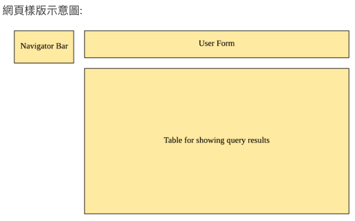

This project was bootstrapped with [Create React App](https://github.com/facebook/create-react-app).

## ikala StraaS Front-end 考題

請於一個星期內完成
使用 git archive 將整個 repository 打包並寄回給 tiffany.chen@ikala.tv

請設計一個 SPA，SPA 設計方向如下：

請設計一個高鐵時刻查詢 Web App ，功能如下

總共兩頁

主體左邊是一個 Navigation Bar ，可以在兩頁間切換

## 第一頁功能要求：
使用者輸入乘車日期、起站與訖站 ID ，按下查詢後，應呈現一個表格並列出至少以下欄位

- 起站名稱
- 起站發車時間
- 訖站名稱
- 訖站到達時間
- 總共乘車時間
- 票價

該頁有提供額外的控制項，能夠針對 “總共乘車時間”，”票價” 進行升序或降序排序

須有適當的錯誤處理
使用者輸入的日期超過查詢範圍，會提示使用者
若 API 回應出現錯誤，系統要能辦別並提示使用者

為完成上述功能，請參考以下網站使用該網站的 API

https://ptx.transportdata.tw/MOTC/Swagger/#/THSRApi

主要 API (若有其它需要的資訊，請自行上該網查詢與研究)
`GET /v2/Rail/THSR/DailyTimetable/OD/{OriginStationID}/to/{DestinationStationID}/{TrainDate}`

## 第二頁功能要求

使用者想了解當天某一站是否對號座還有座位，所以這頁要能提供相關資訊

使用者輸入起站與訖站，按下查詢後，應呈現一個表格，該表格滿足以下條件

列出尚未發車的車次，已經發車的要排除不顯示
標準車箱與商務車箱皆已滿坐的要排除不顯示

該表格需列出以下欄位：

- 起站名稱
- 起站發車時間
- 訖站名稱
- 訖站到達時間
- 總共乘車時間
- 票價 (如果是標準車箱有座位列標準車箱票價，否則就是商務車箱的票價，並提示使用者這是商務車箱票價)

如果起站與訖站間已無任何座位可販售，則不顯示該表格，直接提示使用者已無座位可販售

與第一頁要求相同須包含錯誤處理

主要 API (若有其它需要的資訊，請自行上該網查詢與研究)

`GET /v2/Rail/THSR/AvailableSeatStatusList/{StationID}`

網頁樣版示意圖:

## 技術要求:

- 請讓我們可以了解到平常你使用版本控制工作的流程
- 利用 modern js 來完成以上要求
- 請保持你的程式碼方便閱讀、溝通

使用最新版本的 React 框架
使用 以 React 為基礎的 UI Compoents 來設計 UI
參考： https://material-ui.com/ (可自由發揮，但一定要是 React UI Components)

第一頁與第二頁間的切換可以自行處理，也可以使用 React-router

## 加分題：

- 使用 Redux 管理狀態流
- 撰寫 unit test or e2e test

